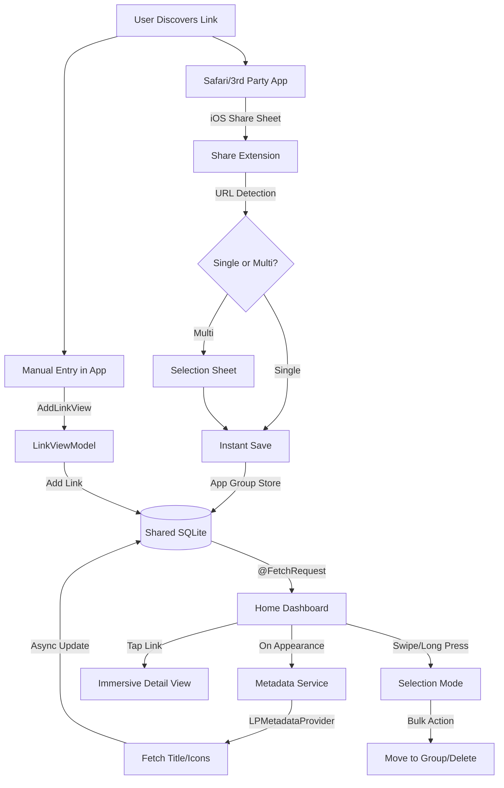

# 🔗 Link Manager Pro
### *The Ultimate Digital Asset Navigator for iOS*

  

  
  
  
  

---

## 🌟 Overview

**Link Manager** is not just another bookmarking app; it is a premium, high-performance command center for your digital life. Built with a "Safety & Speed" first philosophy, it leverages Apple's native frameworks to provide a seamless bridge between your mobile browsing and organized data storage.

---

## 🏎️ App Architecture & Deep Flow

### 📡 The Data Lifecycle
Link Manager utilizes a **Local-First** approach. Data is stored in a shared SQL-backing (Core Data) that lives in an **App Group Container**, allowing the Share Extension to write data even when the main app is closed.

---

## 💎 Premium Feature deep-dives

### 1. 🗂️ Intelligent Grouping System
The app uses a hierarchical category system. By extracting the **Root Domain** from every URL, the app suggests categories automatically.
- **Dynamic Folders**: Create custom "link buckets" for Work, Social, or Research.
- **Batch Transfer**: Selection mode allows you to move hundreds of links into a group in two taps.

### 2. 🤖 Autonomous Metadata Engine
Powered by `LPMetadataProvider` and custom favicon scrapers:
- **Zero Input Required**: Just paste the link; the app fetches the high-res thumbnail and site description in the background.
- **Shimmer States**: While metadata is fetching, the app shows beautiful skeleton animations to maintain a high-quality feel.

### 3. 🚀 Zero-Tap Share Extension
- **Multi-Link Detection**: Copies text containing multiple URLs? The extension automatically parses them into a selectable list.
- **Tactile Feedback**: Integrated Lottie animations (`success.json`, `fail.json`) provide instant visual confirmation of saved state.

---

## 📂 Technical File Breakdown

| Component | Responsibility | Key Frameworks |
| :--- | :--- | :--- |
| **`LinkManagerApp.swift`** | Lifecycle management, Splash Screen handling. | SwiftUI |
| **`Persistence.swift`** | Core Data stack with `appGroupIdentifier` for cross-process sync. | CoreData |
| **`LinkViewModel.swift`** | Business logic, filtering, domain sanitization, and context saving. | Combine |
| **`MetadataService.swift`** | Asynchronous site enrichment and Favicon retrieval. | LinkPresentation |
| **`HomeView.swift`** | Main UI orchestrator with TabView and Search integration. | SwiftUI |
| **`LinkDetailView.swift`** | High-fidelity detail view with blurred background and action sheets. | UIKit (Blur) |
| **`LottieView.swift`** | UIViewRepresentable wrapper for vector-based animations. | Lottie |

---

## 🛠️ Performance Optimizations

- **Image Caching**: Uses `Kingfisher` for high-performance remote image loading and memory management.
- **Background Persistence**: All metadata updates happen on background contexts to ensure the main UI thread never drops below 60fps.
- **Smart Sanitization**: Automatically cleans `www.` and subdomains to keep the UI clean and search-friendly.

---

## 🚀 Setup & Installation

### Prerequisites
- macOS Sonoma or later
- Xcode 15.0+
- A valid Apple Developer account (for App Groups testing)

### Steps
1. **Clone**: `git clone https://github.com/HirenTechie/Link-Manager.git`
2. **App Group Setup**:
   - Go to **Signing & Capabilities** in Xcode.
   - Add the **App Groups** capability to both the Main App and Share Extension.
   - Use the ID: `group.com.hiren.LinkManager` (or your preferred ID).
3. **Update Persistence**: Ensure the ID in `Persistence.swift` matches your Xcode config.
4. **Build**: `Product -> Run (Cmd + R)`.

---

## 📜 License & Acknowledgments
- **Animations**: [Airbnb Lottie](https://github.com/airbnb/lottie-ios)
- **Images**: [Kingfisher](https://github.com/onevcat/Kingfisher)
- **Icons**: SF Symbols 5 & Google Favicon API

---

  <i>"Efficiency is doing things right; effectiveness is doing the right things."</i>

